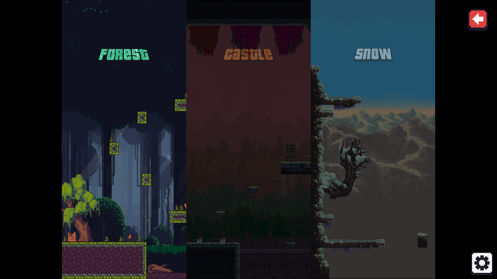

# Dinoguys

## Introduction

**_Dinoguys_** is a web-based platform battle royale game where players could race their friends _online in real-time_ through multiple stages to see who will come out as the winner. Each stage has its own unique map filled with different traps and obstacles, and only a limited amount of players could get to the next stage. The one that finishes the last stage first wins the game!

### Checkout the Deployed Game: https://dinoguys.herokuapp.com/

  
  

  
  

## Libraries / Services Used in This Game

- [Phaser 3](https://phaser.io/) (v.3.55.2)
- [Phaser 3 Rex UI Plugin](https://www.npmjs.com/package/phaser3-rex-plugins?activeTab=readme) (v.1.1.59)
- [Socket.IO](https://socket.io/) (v.4.1.3)
- [Tiled](https://www.mapeditor.org/) (v.1.7.2)

## How to Run the Game Locally

1. Fork and clone this repo.
2. Install the dependencies with: `npm install`.
3. Start the build process and the application with: `npm run start-dev`. If you're using Windows, you may need to execute `npm run start-server` and `npm run build-watch` separately (in their own terminal tabs).
4. Navigate to [localhost:8080](localhost:8080) to see the site in the browser.

## Acknowledgements

Special thanks to Isaac Easton, Sarah Zhao, and Gary Kertis for invaluable advices throughout the development process!
